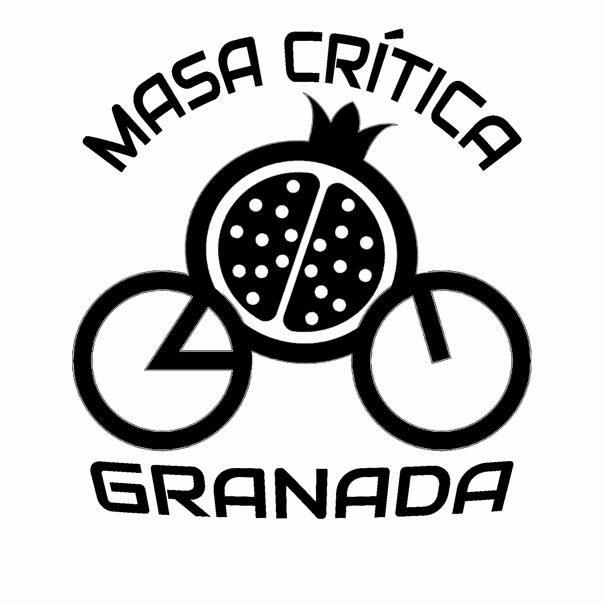

# Critical Mass Granada

**"Masa Critica Granada"** is a project aimed at reclaiming bicycle-friendly spaces in the city of Granada. We meet monthly to ride our bicycles accompanied by a ciclo-soundsystem, creating a vibrant and engaging atmosphere to raise awareness about the need for improved cycling infrastructure in our city. Through peaceful and collective demonstrations, the project seeks to promote sustainable transportation options and advocate for safer and more accessible roads for cyclists in Granada.

## Website

This project is our website code base. It's a simple React site to link to the project's social media profiles and display basic information about the project

## Contributors

- [Jahcuida](https://github.com/jahcuida)
- [Zenidd](https://github.com/Zenidd)

## Get Involved!

Want to join our next ride? Follow us on our [social media](https://linktr.ee/masacriticagr) for updates, routes, and event details. Together, let's make Granada a cycling paradise! 🚲💚

## Contact Us

For more information, suggestions, or in case you want to support us, feel free to reach out: [masacriticagranada@gmail.com](masacriticagranada@gmail.com)

_The only good system is a Sound System!_ 🎶
